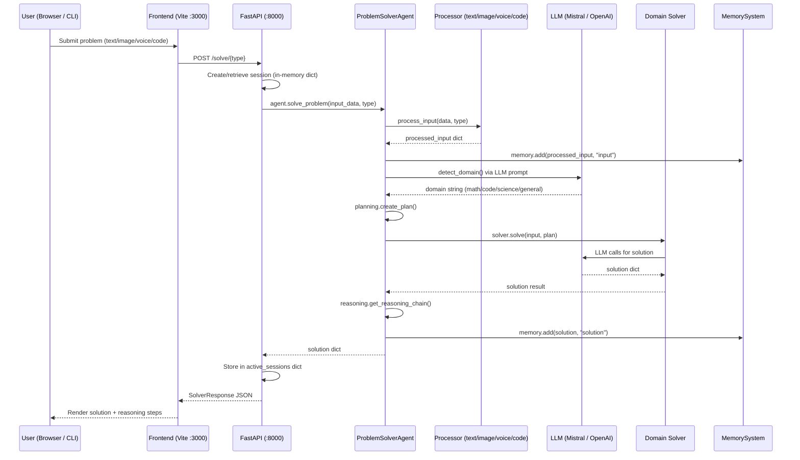
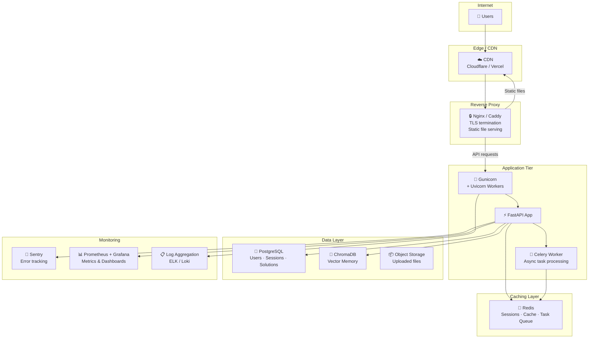

# StackMind — Production Readiness Analysis

## Full System Architecture (Machine Diagram)

```mermaid
graph TB
    subgraph "CLIENT LAYER"
        direction LR
        CLI["🖥️ CLI Interface<br/><code>interfaces/cli.py</code>"]
        WEB["🌐 Vite Frontend<br/><code>frontend/</code><br/>Port 3000"]
    end

    subgraph "API GATEWAY"
        API["⚡ FastAPI Server<br/><code>interfaces/api.py</code><br/>Port 8000"]
        CORS["CORS Middleware<br/><code>allow_origins=*</code>"]
        SESS["📦 In-Memory Sessions<br/><code>active_sessions dict</code>"]
    end

    subgraph "ENTRY POINT"
        MAIN["🚀 main.py<br/>CLI arg parser<br/><code>--api / --debug</code>"]
    end

    subgraph "CORE ENGINE"
        AGENT["🧠 ProblemSolverAgent<br/><code>core/agent.py</code>"]
        MEMORY["💾 MemorySystem<br/><code>core/memory.py</code><br/>Session + ChromaDB"]
        REASONING["🔗 ReasoningEngine<br/><code>core/reasoning.py</code><br/>Chain-of-Thought"]
        PLANNING["📋 PlanningSystem<br/><code>core/planning.py</code><br/>Multi-step Plans"]
        KG["🕸️ KnowledgeGraph<br/><code>core/knowledge_graph.py</code><br/>NetworkX DiGraph"]
        SYMBOLIC["∑ SymbolicComputation<br/><code>core/symbolic.py</code><br/>SymPy Engine"]
        CODEEXEC["⚙️ CodeExecution<br/><code>core/code_execution.py</code><br/>Sandboxed Runner"]
    end

    subgraph "INPUT PROCESSORS"
        TEXTP["📝 TextProcessor<br/><code>processors/text_processor.py</code>"]
        IMGP["🖼️ ImageProcessor<br/><code>processors/image_processor.py</code><br/>OpenCV + Tesseract"]
        VOICEP["🎙️ VoiceProcessor<br/><code>processors/voice_processor.py</code><br/>faster-whisper (GPU)"]
        CODEP["💻 CodeProcessor<br/><code>processors/code_processor.py</code><br/>AST + Radon"]
    end

    subgraph "DOMAIN SOLVERS"
        GENERAL["🌍 GeneralSolver<br/><code>domains/general_solver.py</code>"]
        MATH["📐 MathSolver<br/><code>domains/math_solver.py</code><br/>67 KB · SymPy"]
        CODE_SOLVER["🧑‍💻 CodeSolver<br/><code>domains/code_solver.py</code><br/>81 KB"]
        SCIENCE["🔬 ScienceSolver<br/><code>domains/science_solver.py</code><br/>51 KB"]
    end

    subgraph "LLM PROVIDERS"
        MISTRAL["🟣 Mistral AI<br/><code>integrations/mistral_integration.py</code><br/>ChatMistralAI"]
        OPENAI["🟢 OpenAI<br/><code>integrations/openai_integration.py</code><br/>ChatOpenAI"]
    end

    subgraph "DATA INTEGRATIONS"
        DATAINT["📊 DataIntegration<br/><code>integrations/data_integration.py</code><br/>43 KB"]
        DATASRC["🗄️ DataSources<br/><code>integrations/data_sources.py</code>"]
        TOOLS["🔧 Tools<br/><code>integrations/tools.py</code>"]
    end

    subgraph "EXTERNAL SERVICES"
        YFIN["📈 yfinance"]
        NEWS["📰 NewsAPI / RSS"]
        WEATHER["🌤️ OpenWeatherMap"]
        WEBSCRAPE["🌐 BeautifulSoup"]
        SQLITE["🗃️ SQLite"]
    end

    subgraph "PERSISTENCE"
        CHROMADB["🔵 ChromaDB<br/>Vector Store<br/><code>data/memory/</code>"]
        FSDATA["📁 File System<br/><code>data/</code>"]
        LOGFILE["📋 problem_solver.log"]
    end

    subgraph "CONFIG"
        SETTINGS["⚙️ Settings<br/><code>config/settings.py</code>"]
        ENV[".env / .env.example"]
        PROFILE["JSON Config Profiles"]
    end

    subgraph "QUALITY"
        TESTS["🧪 Tests<br/><code>tests/</code><br/>4 test files"]
        UTILS["🛠️ Utils<br/>helpers · validators · visualization"]
    end

    %% ── Client → API ──
    WEB -->|"HTTP / Vite proxy"| API
    CLI --> MAIN
    MAIN -->|"--api flag"| API
    MAIN -->|"default"| CLI

    %% ── API internals ──
    API --> CORS
    API --> SESS
    API -->|"solve_problem()"| AGENT

    %% ── Agent orchestration ──
    AGENT --> MEMORY
    AGENT --> REASONING
    AGENT --> PLANNING
    AGENT -->|"process_input()"| TEXTP
    AGENT -->|"process_input()"| IMGP
    AGENT -->|"process_input()"| VOICEP
    AGENT -->|"process_input()"| CODEP
    AGENT -->|"detect_domain()"| GENERAL
    AGENT -->|"domain routing"| MATH
    AGENT -->|"domain routing"| CODE_SOLVER
    AGENT -->|"domain routing"| SCIENCE

    %% ── LLM connections ──
    AGENT -->|"_initialize_llm()"| MISTRAL
    AGENT -->|"_initialize_llm()"| OPENAI
    REASONING --> MISTRAL
    REASONING --> OPENAI
    PLANNING --> MISTRAL
    PLANNING --> OPENAI

    %% ── Data flows ──
    MEMORY --> CHROMADB
    MEMORY --> FSDATA
    DATAINT --> YFIN
    DATAINT --> NEWS
    DATAINT --> WEATHER
    DATAINT --> WEBSCRAPE
    DATAINT --> SQLITE

    %% ── Config ──
    MAIN --> SETTINGS
    SETTINGS --> ENV
    SETTINGS --> PROFILE
    MAIN --> LOGFILE

    %% ── Supporting modules ──
    KG -.->|"not wired into agent"| AGENT
    SYMBOLIC -.->|"used by MathSolver"| MATH
    CODEEXEC -.->|"used by CodeSolver"| CODE_SOLVER
    DATAINT -.->|"not wired into agent"| AGENT
    TOOLS -.->|"not wired into agent"| AGENT

    %% ── Styling ──
    classDef critical fill:#fee2e2,stroke:#dc2626,stroke-width:2px,color:#991b1b
    classDef warning fill:#fef3c7,stroke:#d97706,stroke-width:2px,color:#92400e
    classDef ok fill:#d1fae5,stroke:#059669,stroke-width:1px,color:#065f46
    classDef disconnected fill:#f3f4f6,stroke:#9ca3af,stroke-width:1px,stroke-dasharray:5 5,color:#6b7280

    class SESS,CORS critical
    class KG,DATAINT,TOOLS disconnected
    class CHROMADB,MEMORY warning
    class API,AGENT,REASONING,PLANNING ok
```

---

## How the System Currently Works (Data Flow)

---

## Gap Analysis Summary

| Category | Status | Details |
|---|---|---|
| **Authentication** | 🔴 Missing | No auth on any API endpoint |
| **Session Persistence** | 🔴 In-Memory Only | `active_sessions = {}` — lost on restart |
| **Database** | 🔴 None | No PostgreSQL/Redis/MongoDB for production |
| **Rate Limiting** | 🔴 None on API | No per-user or global rate limits |
| **HTTPS / TLS** | 🔴 Missing | HTTP only, no SSL certificates |
| **Deployment Config** | 🔴 Missing | No Dockerfile, no docker-compose, no CI/CD |
| **Error Handling** | 🟡 Basic | Generic 500 errors, no structured error codes |
| **CORS Policy** | 🔴 Wide Open | `allow_origins=["*"]` in production |
| **Frontend API URL** | 🔴 Hardcoded | `const API_BASE = 'http://localhost:8000'` |
| **Environment Config** | 🟡 Partial | `.env` works locally, no production env management |
| **Logging** | 🟡 File Only | No structured logging, no log aggregation |
| **Testing** | 🟡 Minimal | 4 test files, mostly mocked, no integration tests |
| **KnowledgeGraph** | 🟡 Not Wired | Built but not connected to agent pipeline |
| **DataIntegration** | 🟡 Not Wired | 43KB module with no route to agent |
| **Memory (ChromaDB)** | 🟡 Hardcoded | Always uses OpenAI embeddings, even with Mistral |
| **Production Server** | 🔴 Missing | Uses `uvicorn.run()` directly, no Gunicorn |
| **WebSocket / Streaming** | 🔴 Missing | No real-time streaming of solutions |
| **API Versioning** | 🔴 Missing | No `/api/v1/` prefix |
| **Input Validation** | 🟡 Partial | Pydantic models exist but file upload limits missing |
| **Frontend Build** | 🟡 Incomplete | Vite build exists but no static file serving from FastAPI |
| **Monitoring** | 🔴 Missing | No health metrics, no APM, no alerting |

---

## 🔴 CRITICAL — Production Blockers To-Do List

### 1. Security & Authentication
- [ ] **Add user authentication** — JWT or OAuth2 (FastAPI has `fastapi.security`)
- [ ] **Add API key authentication** for programmatic access
- [ ] **Restrict CORS origins** — replace `allow_origins=["*"]` with actual domain list
- [ ] **Add request rate limiting** — per-IP and per-user (e.g., `slowapi` library)
- [ ] **Add input sanitization** for all text inputs (XSS/injection prevention)
- [ ] **Add file upload size limits** and type validation for image/audio endpoints
- [ ] **Audit code execution sandbox** — `CodeExecution` runs subprocess; needs proper isolation
- [ ] **Remove `KMP_DUPLICATE_LIB_OK`** environment hack in `api.py` line 2
- [ ] **Add CSRF protection** if using cookie-based auth
- [ ] **Implement secrets management** — move from `.env` files to vault/secrets manager

### 2. Session & State Persistence
- [ ] **Replace in-memory `active_sessions` dict** with Redis or database-backed store
- [ ] **Add session expiry and cleanup** — currently sessions grow unbounded
- [ ] **Implement proper session middleware** — use FastAPI session handling
- [ ] **Add user-scoped sessions** — sessions currently have no user association
- [ ] **Persist solution history to database** — currently lost on server restart

### 3. Database
- [ ] **Add a production database** — PostgreSQL recommended
- [ ] **Create data models/schemas** — Users, Sessions, Solutions, Feedback
- [ ] **Add database migrations** — Alembic for SQLAlchemy
- [ ] **Replace ChromaDB OpenAI dependency** — Memory system hardcodes `OpenAIEmbeddings()` even when using Mistral
- [ ] **Add connection pooling** — SQLAlchemy async pool for production

### 4. API Architecture
- [ ] **Add API versioning** — prefix all routes with `/api/v1/`
- [ ] **Add structured error responses** — standardized error codes and messages
- [ ] **Fix `refine_solution` signature mismatch** — API passes `session_id, solution_id, feedback_text, options` but agent's `refine_solution()` only accepts `feedback: str`
- [ ] **Add `/solve/file` endpoint** — for direct file upload (not just base64)
- [ ] **Add pagination** to session/solution list endpoints
- [ ] **Add WebSocket endpoint** for real-time solution streaming
- [ ] **Add `/api/status` endpoint** with system metrics (memory, uptime, queue size)
- [ ] **Add request ID tracking** — correlate requests across logs
- [ ] **Add OpenAPI tags and descriptions** — improve auto-generated docs
- [ ] **Add response compression** — gzip middleware

---

## 🟠 HIGH — Essential for Reliable Deployment

### 5. Deployment Infrastructure
- [ ] **Create `Dockerfile`** — multi-stage build for Python backend
- [ ] **Create `Dockerfile` for frontend** — Nginx serving Vite build
- [ ] **Create `docker-compose.yml`** — backend + frontend + Redis + ChromaDB
- [ ] **Add `.dockerignore`** — exclude `node_modules`, `__pycache__`, `.env`
- [ ] **Add production ASGI server** — Gunicorn + Uvicorn workers (`gunicorn -k uvicorn.workers.UvicornWorker`)
- [ ] **Add HTTPS/TLS** — via reverse proxy (Nginx/Caddy) or cloud load balancer
- [ ] **Add health check probes** — readiness + liveness for container orchestration
- [ ] **Create `Procfile`** or equivalent for PaaS deployment (Heroku, Railway, Render)
- [ ] **Add environment-based configuration** — separate dev/staging/production configs
- [ ] **Pin dependency versions** — `requirements.txt` uses `>=` everywhere, pin exact versions

### 6. Frontend Production Readiness
- [ ] **Make API base URL configurable** — use environment variable, not hardcoded `localhost:8000`
- [ ] **Add production build pipeline** — `npm run build` output served by FastAPI or Nginx
- [ ] **Add frontend error boundary** — global error handling for API failures
- [ ] **Add loading states** for all API calls (some views may be missing them)
- [ ] **Add offline/reconnect handling** — show status when backend is down
- [ ] **Add PWA manifest** — for installable web app experience
- [ ] **Add favicon and app icons**
- [ ] **Implement responsive design** — verify mobile/tablet breakpoints
- [ ] **Add accessibility (a11y)** — ARIA labels, keyboard navigation, focus management
- [ ] **Bundle analysis** — ensure no oversized dependencies in the Vite build

### 7. Error Handling & Resilience
- [ ] **Add global exception handler** in FastAPI — catch-all with proper logging
- [ ] **Add retry logic** for LLM API calls (transient failures)
- [ ] **Add circuit breaker pattern** for external API calls (data integrations)
- [ ] **Add timeout configuration** for all LLM calls
- [ ] **Add graceful degradation** — if Whisper model fails to load, still serve text/code
- [ ] **Handle LLM quota exhaustion** — detect 429 errors and inform user
- [ ] **Add request timeout middleware** — kill long-running requests

---

## 🟡 MEDIUM — Feature Completeness & Quality

### 8. Wire Up Disconnected Modules
- [ ] **Integrate KnowledgeGraph into agent pipeline** — currently built but never used by `ProblemSolverAgent`
- [ ] **Wire DataIntegration into solvers** — 43KB of data fetching code not connected to the agent
- [ ] **Expose KnowledgeGraph API endpoints** — frontend has a knowledge-graph view but no backend route
- [ ] **Expose Memory API endpoints** — frontend has a memory view but no backend route
- [ ] **Wire `Tools` module into agent** — `integrations/tools.py` exists but unused
- [ ] **Connect `DataSources` to relevant solvers** — `integrations/data_sources.py` is disconnected

### 9. Testing
- [ ] **Add integration tests** — test full solve pipeline (text → agent → solution)
- [ ] **Add API endpoint tests** — use `httpx.AsyncClient` with FastAPI's `TestClient`
- [ ] **Fix existing test mocks** — `test_core.py` mocks `ChromaDB` but it's `Chroma` in the code
- [ ] **Add frontend tests** — at least smoke tests for each view
- [ ] **Add load testing** — simulate concurrent users with `locust` or `k6`
- [ ] **Add CI pipeline** — GitHub Actions or GitLab CI for automated tests
- [ ] **Add code coverage reporting** — `pytest-cov`
- [ ] **Test voice processor** end-to-end — currently no test for `VoiceProcessor`
- [ ] **Test image processor** end-to-end — verify OCR pipeline
- [ ] **Add tests for each domain solver** — expand `test_solvers.py`

### 10. Monitoring & Observability
- [ ] **Add structured logging** — JSON format for log aggregation (e.g., `structlog`)
- [ ] **Add request/response logging middleware** — log method, path, status, duration
- [ ] **Add APM integration** — Sentry, Datadog, or OpenTelemetry
- [ ] **Add Prometheus metrics endpoint** — `/metrics` for scraping
- [ ] **Track LLM token usage** — monitor cost and quota
- [ ] **Add alerting** — for error spikes, high latency, service downtime
- [ ] **Log rotation** — `problem_solver.log` grows unbounded currently

### 11. Performance
- [ ] **Add async support to agent** — `solve_problem()` is synchronous, blocks the event loop
- [ ] **Add response caching** — cache identical queries for configurable TTL
- [ ] **Add background task queue** — Celery or FastAPI `BackgroundTasks` for long-running solves
- [ ] **Profile LLM call latency** — identify bottlenecks in the pipeline
- [ ] **Optimize domain detection** — consider local classifier instead of LLM call every time
- [ ] **Lazy-load heavy models** — Whisper, CUDA models loaded at startup; move to on-demand
- [ ] **Add connection pooling** for external HTTP requests in DataIntegration

### 12. Documentation
- [ ] **Add API documentation page** — auto-generated OpenAPI is there, but needs better descriptions
- [ ] **Create deployment guide** — step-by-step for Docker, cloud (AWS/GCP/Azure), PaaS
- [ ] **Create developer setup guide** — beyond TUTORIAL.md, include frontend setup
- [ ] **Document environment variables** — complete list with descriptions and defaults
- [ ] **Add architecture decision records (ADRs)** — why Mistral, why ChromaDB, etc.
- [ ] **Add CHANGELOG.md** — track releases and changes
- [ ] **Add CONTRIBUTING.md** — for open-source contributions
- [ ] **Add LICENSE file** — choose and add an open-source license

---

## 🟢 LOW — Polish & Nice-to-Haves

### 13. Frontend Enhancements
- [ ] **Add dark/light mode toggle** — design system CSS supports it, wire up the toggle
- [ ] **Add real-time solution streaming** — WebSocket for token-by-token display
- [ ] **Add solution export** — PDF, Markdown, clipboard copy
- [ ] **Add file drag-and-drop** — for image and audio uploads
- [ ] **Add keyboard shortcuts** — Ctrl+Enter to submit, etc.
- [ ] **Add solution history sidebar** — persistent across sessions
- [ ] **Add Markdown rendering** — for solution display (code blocks, math, etc.)
- [ ] **Add LaTeX rendering** — MathJax/KaTeX for math solutions
- [ ] **Add code syntax highlighting** — Prism.js or highlight.js

### 14. Backend Enhancements
- [ ] **Add solution comparison endpoint** — ReasoningEngine has `compare_solutions()` but no API route
- [ ] **Add problem analysis endpoint** — ReasoningEngine has `analyze_problem()` but no API route
- [ ] **Add plan visualization endpoint** — PlanningSystem has `get_plan_visualization()` but no route
- [ ] **Add user preference endpoints** — MemorySystem has preference methods but no API route
- [ ] **Add multi-language support** — i18n for responses
- [ ] **Add webhook/callback support** — notify external systems on solution completion
- [ ] **Add batch problem solving** — solve multiple problems in one request
- [ ] **Add solution version history** — track refinement chain

### 15. DevOps & Operations
- [ ] **Add pre-commit hooks** — flake8, isort, mypy checks
- [ ] **Add automatic dependency updates** — Dependabot or Renovate
- [ ] **Add staging environment** — separate from production
- [ ] **Add database backup strategy** — automated backups for ChromaDB and any SQL DB
- [ ] **Add blue/green deployment** — zero-downtime deployments
- [ ] **Add feature flags** — gradual rollout of new features

---

## ⚠️ Critical Bugs / Code Issues Found

| File | Issue | Severity |
|---|---|---|
| [api.py](file:///c:/Users/SAMEER%20PASHA/OneDrive/Documents/Projects/StackMind/interfaces/api.py#L2) | `os.environ["KMP_DUPLICATE_LIB_OK"] = "TRUE"` is a hack, not production-safe | 🔴 |
| [api.py](file:///c:/Users/SAMEER%20PASHA/OneDrive/Documents/Projects/StackMind/interfaces/api.py#L109) | `active_sessions = {}` — all sessions lost on restart | 🔴 |
| [api.py](file:///c:/Users/SAMEER%20PASHA/OneDrive/Documents/Projects/StackMind/interfaces/api.py#L499) | `refine_solution()` signature mismatch vs `agent.refine_solution(feedback)` | 🔴 |
| [memory.py](file:///c:/Users/SAMEER%20PASHA/OneDrive/Documents/Projects/StackMind/core/memory.py#L59) | `OpenAIEmbeddings()` hardcoded — fails when using Mistral without OpenAI key | 🔴 |
| [api.js](file:///c:/Users/SAMEER%20PASHA/OneDrive/Documents/Projects/StackMind/frontend/js/api.js#L6) | `API_BASE = 'http://localhost:8000'` hardcoded — breaks in production | 🔴 |
| [.gitignore](file:///c:/Users/SAMEER%20PASHA/OneDrive/Documents/Projects/StackMind/.gitignore#L48) | `*.html` in gitignore — would exclude `frontend/index.html` from git | 🟡 |
| [settings.py](file:///c:/Users/SAMEER%20PASHA/OneDrive/Documents/Projects/StackMind/config/settings.py#L22) | CORS `["*"]` in default config — security risk in production | 🟡 |
| [code_execution.py](file:///c:/Users/SAMEER%20PASHA/OneDrive/Documents/Projects/StackMind/core/code_execution.py#L227) | Shell blocklist is absurdly long (200+ patterns) but still uses `shell=True` | 🟡 |
| [test_core.py](file:///c:/Users/SAMEER%20PASHA/OneDrive/Documents/Projects/StackMind/tests/test_core.py#L36) | Mocks `ChromaDB` but actual import is `Chroma` — test would fail | 🟡 |

---

## Deployment Architecture Target (Recommended)

---

## Priority Execution Order

> [!IMPORTANT]
> Start with items that **block deployment entirely**, then work outward.

| Phase | Focus | Items |
|---|---|---|
| **Phase 1** (Week 1) | 🔴 Unblock deployment | Dockerfile, HTTPS, fix hardcoded URLs, pin deps, add Gunicorn |
| **Phase 2** (Week 2) | 🔴 Security baseline | Auth (JWT), CORS lockdown, rate limiting, input validation |
| **Phase 3** (Week 3) | 🔴 Data persistence | Redis sessions, PostgreSQL, fix Memory embeddings |
| **Phase 4** (Week 4) | 🟠 Reliability | Error handling, retries, timeouts, health probes, logging |
| **Phase 5** (Week 5) | 🟡 Feature completion | Wire KnowledgeGraph, DataIntegration, add missing API routes |
| **Phase 6** (Week 6) | 🟡 Testing & CI | Integration tests, CI pipeline, load testing |
| **Phase 7** (Ongoing) | 🟢 Polish | Streaming, frontend enhancements, monitoring, docs |
